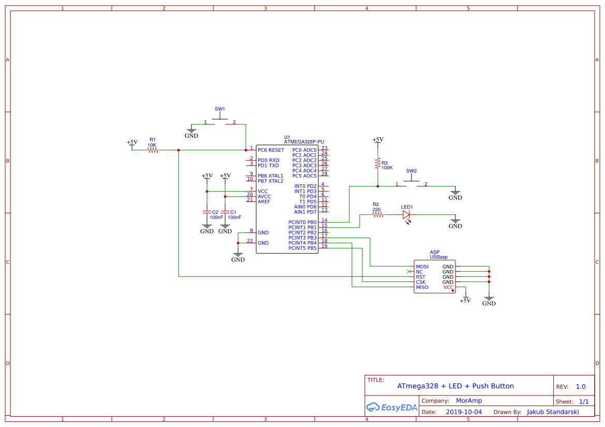
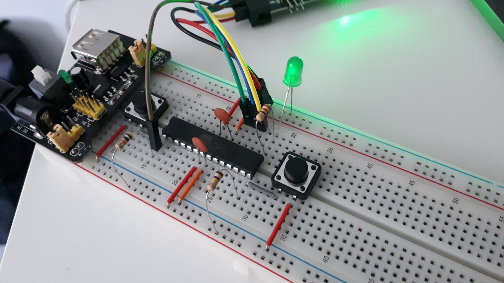

# Interview project for MorAmp

### Goal

The following project assumes three objectives:

1. Prepare and assemble electronic system which consists of microcontroller,
LED and push button. LED while pressing the push button should work in this
manner: 500ms ON, 250ms OFF (iterates 3 times), then turn off. If push button
is not pressed, LED turns off immediately.

2. System in the response for the request from eg. UART, should do complete
test set, which ensures proper system functioning and informs about potential
errors.

3. Prepare external test device as a "black-box" and describe testing
procedure.


### List of used elements (main system)

`Microcontrollers`
- ATmega328P-U DIP

`Programmer`
- AVR USBasp ISP

`Capacitors`
- 100nF Ceramic (C1, C2)

`Resistors`
- 10K (R1)
- 220 (R2)
- 100K (R3)

`LED`
- Green LED (LED1)

`Tact switches`
- Tact switch 12x12mm 7mm THT 4pin (SW1, SW2)


### Electronic system schematic (main system)

System schematic is made in free software `EasyEDA` - electronic circuit
design tool:




Circuit made on the breadboard:




### Building and flashing firmware

To build and flash firmware:

```sh
$ make all
$ make flash
```

Output of `make all`:

```sh
avr-gcc -std=c99 -Wall -g -Os -mmcu=atmega328p -DF_CPU=1000000 -I. -o main.bin main.c
avr-objcopy -j .text -j .data -O ihex main.bin main.hex
```

Output of `make flash`:

```sh
avr-gcc -std=c99 -Wall -g -Os -mmcu=atmega328p -DF_CPU=1000000 -I. -o main.bin main.c
avr-objcopy -j .text -j .data -O ihex main.bin main.hex
MacBook-Pro:Source_Code busketzz$ make flash
avrdude -p atmega328p -B 4 -c usbasp -U flash:w:main.hex:i -F -P usb

avrdude: set SCK frequency to 187500 Hz
avrdude: AVR device initialized and ready to accept instructions

Reading | ################################################## | 100% 0.00s

avrdude: Device signature = 0x1e950f (probably m328p)
avrdude: NOTE: "flash" memory has been specified, an erase cycle will be performed
         To disable this feature, specify the -D option.
avrdude: erasing chip
avrdude: set SCK frequency to 187500 Hz
avrdude: reading input file "main.hex"
avrdude: writing flash (658 bytes):

Writing | ################################################## | 100% 0.44s

avrdude: 658 bytes of flash written
avrdude: verifying flash memory against main.hex:
avrdude: load data flash data from input file main.hex:
avrdude: input file main.hex contains 658 bytes
avrdude: reading on-chip flash data:

Reading | ################################################## | 100% 0.22s

avrdude: verifying ...
avrdude: 658 bytes of flash verified

avrdude: safemode: Fuses OK (E:FF, H:D9, L:62)

avrdude done.  Thank you.
```

